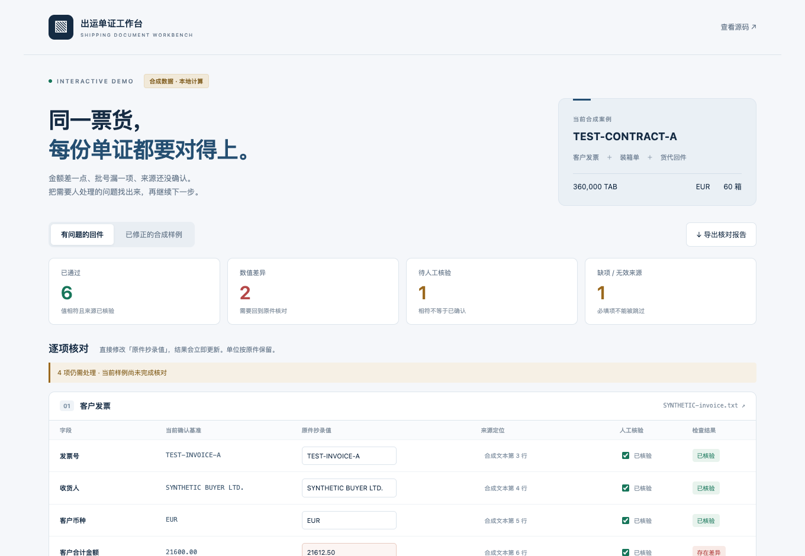

# 出运单证工作台 · Shipping Document Workbench

A local-first export-document workbench with human review, deterministic calculations, and optional AI-assisted extraction.

把一票出运资料整理成可核对、可复用、可生成文件的工作流程。项目来自药品出口单证场景：同一个产品的数量、批号、价格和包装信息，需要同时进入发票、箱单、报关资料和运输文件；人工反复抄写容易造成前后不一致。

工作台按「资料 → 核对 → 文件」组织操作。人确认业务事实，程序负责计算、字段复用、模板填写和版本追踪；AI 可以辅助提取资料，但不替人决定缺失的价格、批次和运输条件。

## 先体验：单证预检台

[打开在线交互演示 →](https://ginbrooks.github.io/demos/shipping/)



一份发票多写了 **EUR 12.50**，装箱单多写了 **600 TAB**、漏了批号，货代回件的目的地还没有人工核验。预检台会逐项显示差异、缺项和待核验状态。你可以改抄录值、打开合成文本查看对应行、标记人工核验，再下载带输入指纹的 JSON 报告。修改值或来源定位后，原来的“已核验”会自动取消。

不需要安装应用、模型密钥或私有模板。静态文件在 [`docs/demo/`](docs/demo/)，下载仓库后直接打开 `docs/demo/index.html`；建议用本地服务器运行，确保报告下载可用：

```bash
python3 -m http.server 8769 --bind 127.0.0.1 --directory docs/demo
# 打开 http://127.0.0.1:8769
```

**这是真实执行规则的浏览器演示，数据全部合成。** 确认基准由 Python 生成；浏览器按相同规则比较抄录值，使用整数十进制运算，支持 kg → g。它不会读取你的文件、调用模型或连接后台。Python/JavaScript 的共享规则有一致性测试。浏览器仅演示固定清单；完整 Python 入口还检查合同范围、重复记录、来源绑定和基础包装计算。

## 已实现

- **四类资料流程**：整套报关资料、出运草件、结汇资料、空运/陆运托书，按用途显示待核对字段。
- **有来源的人工核对**：区分缺失、冲突和待确认值；保护人工修正，共用信息只填一次，跨票带入需要重新确认。
- **确定性业务计算**：金额使用 Decimal；客户价格与报关价格分开；包装、重量、体积和打托约束由程序计算。
- **文件与版本管理**：适配固定模板，生成可编辑文件、PDF 及整套 ZIP；数据修改后识别受影响的输出。
- **可选 AI 提取**：本地读取 Word、Excel 和 PDF，按用户操作调用模型；失败时保留草稿和已有结果，仍可手填。
- **本地运行**：Python、Streamlit、SQLite；另附 macOS 窗口、OCR 和钥匙串辅助程序源码。
- **覆盖式单证预检**：每合同生成客户发票、装箱单、货代回件核对清单，删除来源记录仍会显示缺项。区分差异、无效单位、来源缺失、未确认基准和待人工核验；保留重复/未知记录并阻断。报告绑定主数据、来源记录、文件清单和规则版本，修改后可检测旧报告失效。

## 公开版本包含什么

本仓库包含应用源码、合成测试数据、模板映射结构和无需真实资料的回归测试。**不包含客户资料、真实合同、公司模板、印章、API 密钥、数据库或交易/业务记录。**

可以直接运行界面、手填核对及合成数据演示。生产使用中的四套完整出单依赖已适配的私有底稿与公司配置，克隆本仓库后不会自动拥有这些文件。其他公司的底稿需要单独适配，不能把本项目当作通用模板转换器。

## 快速开始

需要 Python 3.11：

```bash
git clone https://github.com/ginbrooks/shipping-document-workbench.git
cd shipping-document-workbench
python3.11 -m venv .venv
source .venv/bin/activate
python -m pip install -r requirements.txt
python -m streamlit run app.py --server.address=127.0.0.1 --browser.gatherUsageStats=false
```

界面只监听本机。没有模型密钥也可以创建草稿、手工核对和保存。

### 无密钥合成演示

```bash
python scripts/public_demo.py --output demo-output
```

演示创建两份虚构合同，计算打托方案，分别生成客户价与报关价的上下文，并输出合成输入、计算结果和演示说明。该演示不调用模型、不读取私人资料，也不声称生成正式单证。

### 可复用的预检命令行

```bash
# 生成问题 / 修正样例、完整输入和核对报告
python scripts/preflight_demo.py --output demo-output/preflight

# 使用自己的已抄录数据（输入结构参考生成的 after-input.json）
python scripts/preflight_demo.py \
  --input demo-output/preflight/after-input.json \
  --output demo-output/my-review
```

自有输入需要 `shipment`（本项目的业务主数据模型）、`scope`（一个合同 ID）、`documents`（来源文件清单）、`observations`（逐项抄录值与定位）。`synthetic_only` 对真实输入应省略或设为 `false`。详见[输入结构与规则边界](docs/preflight.md)。CLI 输出 `report.json`；退出码 `0` 表示这些检查已相符、等待经办人审核，`2` 表示仍有阻断，`1` 表示输入无效。**该入口核对的是抄录值，不做 OCR、原件真实性检查或出运批准。**

```python
from shipping.preflight import build_preflight, is_report_current

report = build_preflight(shipment, observations, scope, documents)
# 任一业务字段、来源、确认状态或文件清单改变后，都需要重跑
current = is_report_current(report, shipment, observations, scope, documents)
```

### 测试

```bash
python -m pytest -q
```

公开测试集中保留无需私有模板的字段核对、资料解析、金额隔离、版本、布局规则与 UI 测试；依赖真实底稿的历史测试未打包。需要私有配置或 macOS 已编译辅助程序的测试会明确跳过。

GitHub Actions 安装 Python 3.11 和 Node.js，运行回归测试与离线演示，并校验已提交的静态演示数据可由当前 Python 规则重建。本地没有 Node.js 时，仅浏览器规则一致性测试会跳过。

## 代码结构

```text
app.py              Streamlit 入口
shipping/           数据、计算、提取、模板与版本服务
shipping/agent/     资料处理、字段核对、业务组包和排版检查
shipping/ui/        资料、核对、文件界面
shipping/preflight.py  确定性预检、必填覆盖、报告及指纹
docs/demo/          无依赖静态交互演示、可复核的合成文本
config/             默认配置；不是通用运输标准
templates/          不含私人文档的模板映射
fixtures/           虚构的验收数据
tests/              可公开复现的回归测试
desktop/            macOS 辅助程序源码
```

## 当前边界

- 已适配模板的本机出单流程和新资料的 AI 识别准确率是两回事；后者仍需更多真实样本验证。
- PDF 排版检查需要本机 LibreOffice；业务核对仍由经办人完成。
- Windows 原生窗口、多人协作、自动报关申报和跨软件打印未完成验收。
- 当前包含固定模板适配逻辑，不是 ERP、多租户服务或通用文档平台。
- 预检清单覆盖已声明的字段，不代表整套出运资料合规或完整。文件名、定位是调用方提供的线索；要接入真实附件验证，应复用工作台来源校验，而不能仅凭文件名断言原件存在。

作者：[ginbrooks](https://github.com/ginbrooks)
